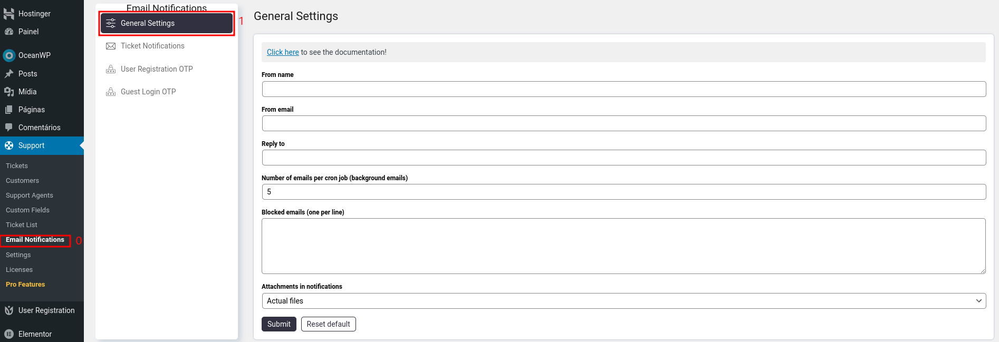
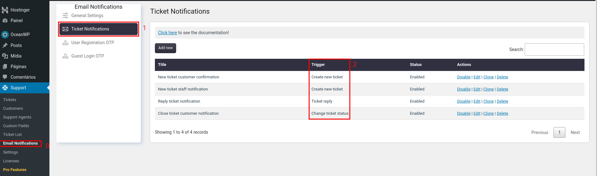
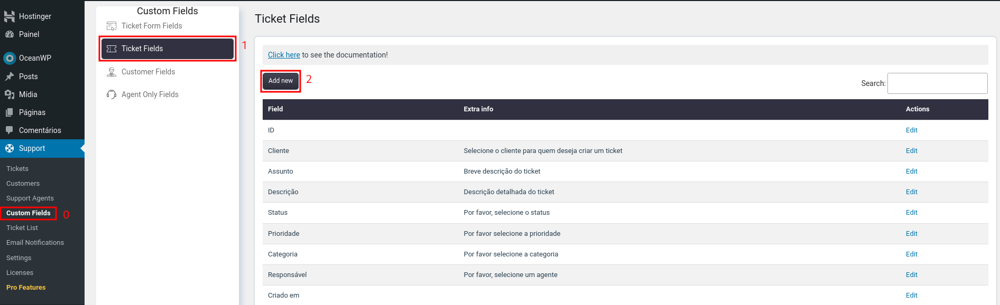

# Índice
* [Adicionar novo agente](#adicionarnovoagente)
* [Adicionar nova função de agente](#adicionarnovafuncaoagente)
* [Configuração de notificação por email](#configuracaonotificacaodeemail)
* [Notificação por ticket](#notificacaoticket)
* [Campos de ticket](#camposdeticket)
* [Campos do formulário de ticket](#camposdoformularioticket)

## Adicionar novo agente

1. Ir para **Support** -> **Support Agents** -> **Add Agent**   

   

2. Selecione um ou mais usuários existentes ("Select Users")
3. Selecione função ("Select role")
4. Clique em "Submit"   

   

**Observação:**
Por padrão, existem duas funções instaladas:
- **Administrador** ("Administrator") - Possui todos os recursos possíveis
- **Agente** ("Agent") - Possui recursos limitados

## Adicionar nova função de agente
1. Ir para **Support** -> **Support Agents** -> **Agent Roles**   

   

Na tela "Agent Roles", podemos adicionar o **nome da nova função (Label)** e definir

- Unassigned (Não atribuído)
- Assigned to me (Atribuído a mim)
- Assigned to other (Atribuído a outros)
- Outras permissões (Other permissions)   

   

## Configuração de notificação por email
1. Ir para **Support** -> **Email Notifications** -> **General Settings**   

   

### Campos do formulario de configuração do e-mail

- From name (Do nome) - Nome do e-mail (assunto)
- From email (Do e-mail) - Endereço de e-mail do qual o e-mail sera enviado
- Number of emails per cron job (background emails) (Número de e-mails por trabalho cron) define o número máximo de e-mails que devem ser enviados de uma só voz
- Blocked emails (one per line) (E-mails bloqueados) - Defina os endereços de e-mail para os quais você não deseja enviar notificações
- Attachements in notifications (Anexos nas notificações) - Aqui você pode definir se deseja enviar os arquivos (Actual files), links reais de anexos (Files links), ou desativar o anexo nas notificações (Disable)

## Notificação por ticket
1. Ir para **Support** -> **Email Notifications** -> **Ticket Notifications**   

   
²Eventos de ticket

E nesta seção que podemos configurar os modelos de notificação por e-mail para 
cada evento de ticket especifico.

**Observação:** por padrão o plugin já tras uma configuração para cada uma dos 
principais eventos de ticket.

## Campos de ticket
E aqui que você criar os seus campos de tickets personalizados

1. Ir para **Support** -> **Ticket Fields**   

   

## Campos do formulário de ticket
E aqui que podemos personalizar os campos do formulário de ticket

1. Ir para **Support** -> **Custom Fields** -> **Ticket Form Fields**   