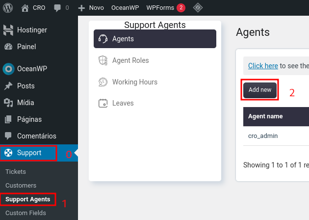
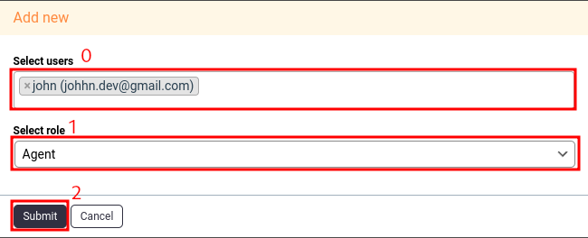
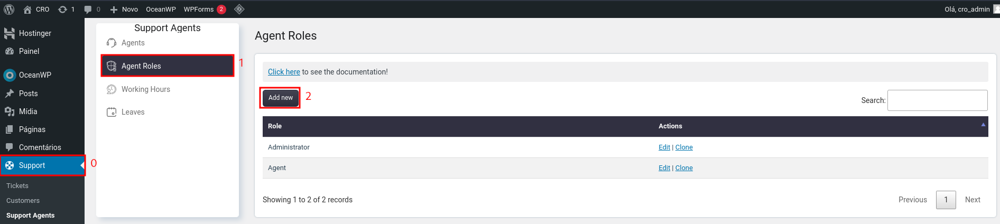
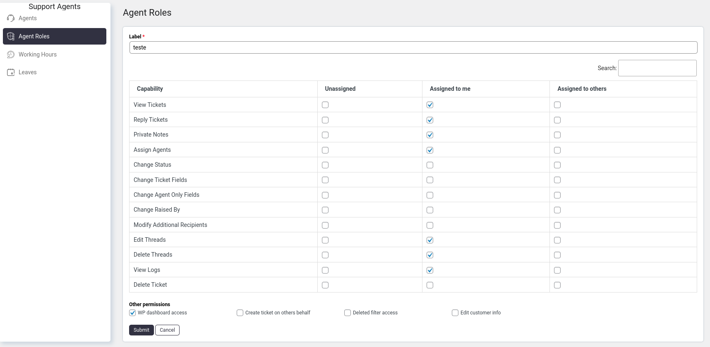

# Índice
* [Adicionar novo agente](#adicionarnovoagente)
* [Adicionar nova função de agente](#adicionarnovafuncaoagente) (pro)

## Adicionar novo agente

1. Ir para **Support** -> **Support Agents** -> **Add Agent**   

   

2. Selecione um ou mais usuários existentes ("Select Users")
3. Selecione função ("Select role")
4. Clique em "Submit"   

   

**Observação:**
Por padrão, existem duas funções instaladas:
- **Administrador** ("Administrator") - Possui todos os recursos possíveis
- **Agente** ("Agent") - Possui recursos limitados

## Adicionar nova função de agente
1. Ir para **Support** -> **Support Agents** -> **Agent Roles**   

   

Na tela "Agent Roles", podemos adicionar o **nome da nova função (Label)** e definir

- Unassigned (Não atribuído)
- Assigned to me (Atribuído a mim)
- Assigned to other (Atribuído a outros)
- Outras permissões (Other permissions)   

   